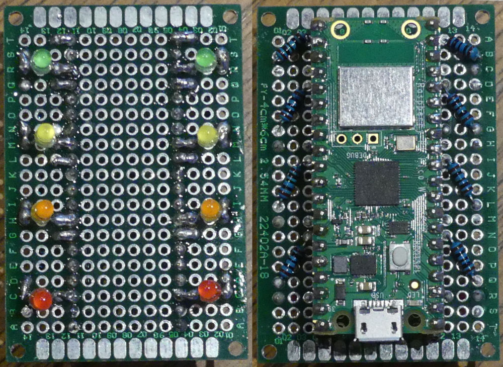
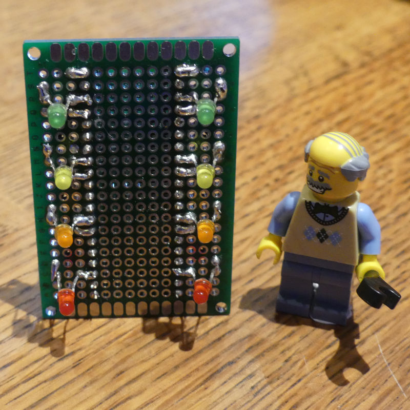
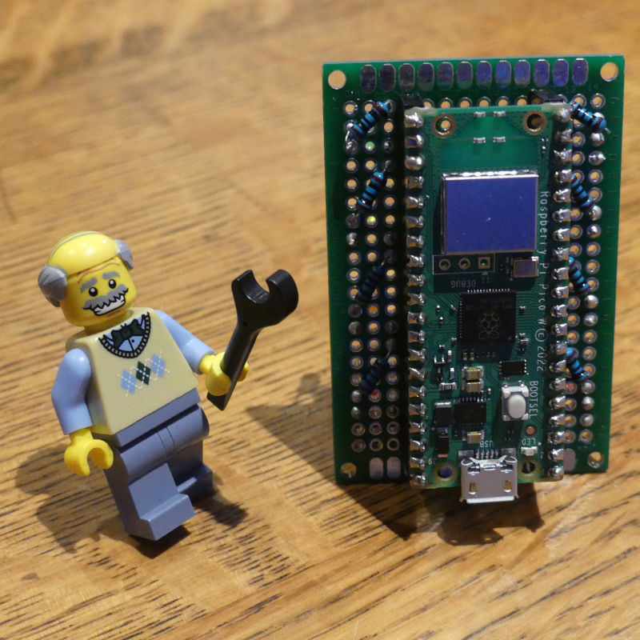

# Developing ShowBoat

## Introduction

Caledonian MacBrayne ("CalMac") have a network of ferries serving the Western Isles and islands in the Clyde Estuary in Scotland. These are considered "lifeline" services for the islands that they sail to, and any disruption to sailings can cause significant problems for both islanders and visitors. Disruption can be caused by weather, equipment failure, routine maintenance, and even tidal conditions. Knowing about disruption as soon as possible helps ferry users to make alternative plans.

CalMac provides a service status page on their website and an app for Android and Apple devices, as well as an SMS notification service that regular ferry users can subscribe to. These services cover all of the CalMac routes. Most ferry users are only interested in the one or two routes that serve their own island. I wanted to make a simple hardware indicator that could show, at a glance, the service status on the routes that serve a particular location.

While I was initially making this just for my own use, I thought that other people might also find it helpful, so I wanted to keep the design relatively cheap and straightforward. The Raspberry Pi Foundation had just launched the Raspberry Pi Pico W, which opened up the possibility of making a very cheap, Internet-connected device to show simple status information.

## Design considerations

### How to display service status?

The real-time service information provided by CalMac uses four different status levels for each route:

These status levels are distinguished by three different design features:

- Text description

- Symbol (tick, exclamation mark(s), cross)

- Colour (green, yellow, amber, red)

My project could use any or all of these design features to represent the service status, however the choice of features would have a big effect on the cost and complexity of the project: 

- a text status would require a display that could show at least 36 characters (the longest phrase) at a size that was readable across a room - such a display would be relatively expensive and might have high power requirements.

- A status symbol could be displayed by a matrix of LEDs, either single-color or RGB, but matrices of sufficient size are still fairly costly and complex to drive. A symbol could also be illuminated from behind by an LED, but this would make the enclosure design much more complex.

- A colour status could be represented by a single analogue or digitally-addressable RGB LED, or by a column of different single-colour LEDs. The problem with using a single LED was that I found it could be hard to distinguish between some colours ("is that yellow or amber?"). Using a column of single-colour LEDs showed the status using both colour _and_ position and so was easier to read correctly at a glance. Although this increased the component count, those components were so cheap that it was still the best and lowest-cost option.

The other factor that led me to the "column-of-LEDs" approach was the physical design of the Raspberry Pi Pico W that I wanted to use. The regular ordering and spacing of the GPIO and ground pads in symmetrical columns down each side of the device really helps with this project!

_Side note_: The CalMac status page also shows a "Supplementary Information" indicator by each route status. This used to warn of indirect issues, such as road closures on the routes to ports, and was quite helpful, but since COVID19 it seems that _every_ route has supplementary information _all the time_, so it has lost its usefulness as an indicator. I decided not to worry about trying to include a "Supplementary Information" indicator in this project!

### How many routes?

The full CalMac network has 30 different routes but it is not necessary to show the status of all of these routes for a particular location. Most islands are served by only one or two routes  (though some mainland ports may serve more routes than this). I've assumed that showing the status of only one or two routes should be sufficient for most people. The Raspberry Pi Pico W has sufficient GPIO to show up to 6 routes with four status LEDs each, but showing more than 2 routes would require a more complex design.

### Obtaining service status

CalMac offers three main methods of checking their service status:

- On their website at [https://www.calmac.co.uk/service-status](https://www.calmac.co.uk/service-status)

- Using their [Android](http://play.google.com/store/apps/details?id=com.CalMacStatus) or [Apple](http://itunes.apple.com/us/app/directv/id396345728?mt=8) app

- By signing up to an SMS alert service

A bit of judicious analysis of web page code and traffic sniffing revealed a very simple API that serves the status information to both the web page and apps:

- *https://www.calmac.co.uk/service-status/?{query}* for the full website

or

- *http://status.calmac.info/?{query}* for the app

The _{query}_ can take one of two forms:

- _ajax=json_ - responds with JSON-encoded information for ALL routes

- _route=NN_ - responds with an HTML page with information about a single route

So far I have only been able to get one of these two things. Any attempt to combine parameters to refine the query (eg _ajax=json&route=05_) just responds with the full status web page for all routes.

## Hardware Prototype

The LEDs that I used for the prototype had the following characteristics:

| Value | Red  | Orange | Yellow | Green |
| ----- | ---- | ------ | ------ | ----- |
| Vf    | 1.9V | 1.9V   | 2.0V   | 2.1V  |
| If    | 30mA | 30mA   | 20mA   | 30mA  |

Using an [LED calculator](http://ledcalc.com/) for the correct current limiting resistor at the Pico's voltage of 3.3V gave values in the range 40-65 Ohms, so I thought that using 100 Ohm resistors should be safe enough while keeping the LEDs nice and bright. This was a bit too successful - the green LEDs in particular were so bright they could light up a darkened room! They were difficult to look at straight on - it might be necessary to tone them down a bit for the final version.

I used a small protoboard for my prototype (with a socketed Pico W), with the LEDs mounted on the front and the resistors and Pico W mounted on the rear to keep things looking clean. Arranging the LEDs according to the evenly-spaced ground pads on the Pico W resulted in two neat columns of indicator lights which could be used for the two different ferry routes. The Pico W had its USB port facing downwards because I imagined the device eventually hanging on a wall with the USB power supply cable dangling down from it.

I made a temporary enclosure for the prototype out of a small cardboard box (from an official Raspberry Pi power supply, I think). You could always use a different arrangement, and to keep things even simpler it should be possible to solder the components directly onto the Pico W [dead bug style](https://www.instructables.com/Dead-Bug-Prototyping-and-Freeform-Electronics/).